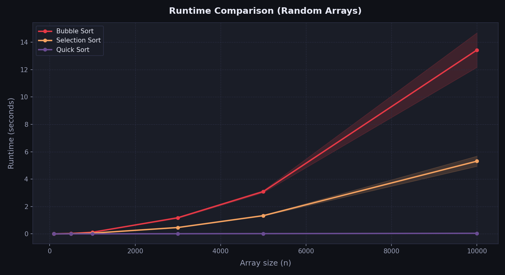
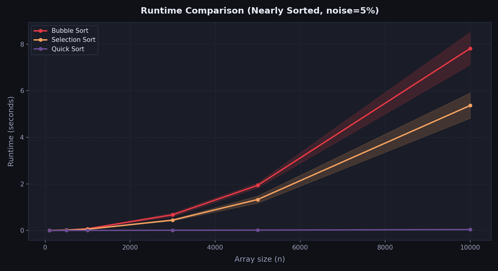

# Sorting Assignment – Data Structures Spring 2026

## Student Name
*(שיימא אבו עסא, ת״ז: 212976401)*

---

## Selected Algorithms
- Bubble Sort
- Selection Sort
- Quick Sort

---

## Results

### result1.png – Random Arrays

Bubble Sort and Selection Sort are slow on random arrays. Their runtime grows quickly as the array gets larger. Quick Sort is much faster and stays efficient even at large sizes.

---

### result2.png – Nearly Sorted Arrays (5% noise)

Quick Sort is still the fastest. Bubble Sort improved noticeably compared to random arrays. Selection Sort stayed about the same.

**Observed changes vs. random arrays:**

- **Bubble Sort** became much faster. When the array is almost sorted, it detects early that no swaps are needed and stops. So it does far less work than on a random array.
- **Selection Sort** did not improve. It always scans the entire unsorted part to find the minimum, no matter how sorted the array already is. Nearly sorted input gives it no benefit.
- **Quick Sort** stayed fast with little change. It already performs well on random data, and nearly sorted data does not affect it much.
